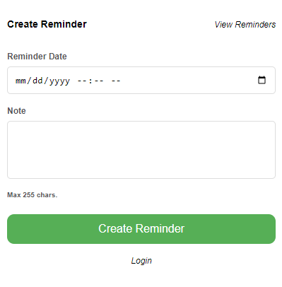

# Google Chrome Reminder Plugin

This is a simple reminder plugin. Use this to quickly create reminders for yourself.
The user can create an account to log reminders to a server or they can use it as is without any signup.
If you are logged in, the reminders are stored in the back end, if not the reminders are stored in your local browser storage.
If logged in you can access your reminders accross multiple browsers and even if your browser storage is full or cleared you wont lose what you have created.

Dependencies:
    Backend: Python/user-reminder-service
    Sign-up process: React/micro-frontend-react/user-notification-sign-up

View demo here:
